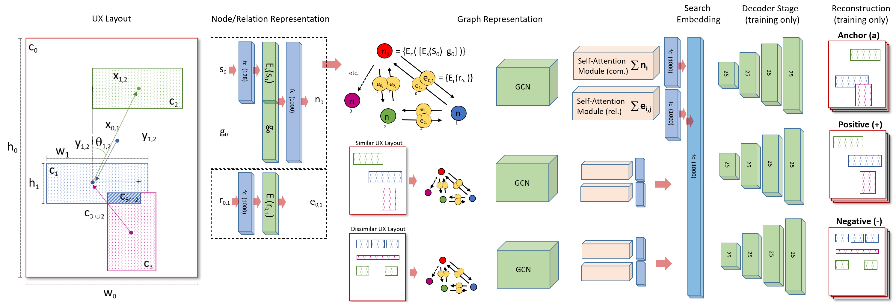

# Learning Structural Similarity of User Interface Layouts using Graph Networks

<div align="center">
  
</div>


## Datasets
### RICO Dataset
* Download RICO dataset from [rico](https://interactionmining.org/rico) (Optional)
* We use semantic UI screenshots and annotations. Simplified annotation for semantic RICO UIs is given in `data/rico_box_info_list.pkl`
* Data partition sets (train/gallery/query) used for all experiments are in `data/UI_data.p` and `data/UI_test_data.p`
 

### GoogleUI Dataset
* We release GoogleUI dataset. GoogleUI is a new dataset of 18.5K UX designs collected from web.
* Dataset/annotations/descriptions can be obtained from [Google Drive](https://drive.google.com/drive/folders/1LdhtDfiv48jSAbaLmL3rbrLBi4ZByd6p?usp=sharing)


## Evaluation and trained model
To evaluate the model:
* `mkdir trained_models`
* Download  trained models from [here](https://drive.google.com/drive/folders/1aBBUF76I9zXr50Yet3csY1Dhw7--ykti?usp=sharing) into `trained_models/`
* Prior to evaluation/training, prepare graph represenatations for UIs following steps below:
	* Run `python graph_scripts/cal_geometry_feat.py`. This will compute the geometric features for all rico UIs
	* Run `python graph_scripts/build_geomerty_graph.py`. This will pre-construct the graph data for UIs; saved under `graph_data/`
* Run `python evaluate.py` to get the performance metrics: top-k mIoU and mPixAcc


## Training GCN-CNN
* To train GCN-CNN model
```
python train.py --batch_size 10 --decoder_model 'strided' --dim 1024 \
--use_directed_graph True 
```	

* For faster dataloading and training, it is recommended to pre-compute the 25-Channel representations for all RICO UIs
	* To do so: run `python compute_25Chan_Imgs.py` 
	* This will save all 25 Channel represenations for all UIs into data/25ChanImages

* To train GCN-CNN model using pre-computed 25-Channel representations
 
```
python train.py --batch_size 10 --decoder_model 'strided' --dim 1024 \
--use_directed_graph True \
--use_precomputed_25Chan_imgs True\
--Channel25_img_dir 'data\25ChanImages'
```		
The model is saved into outpur_dir. It performs retrieval evaluation every *N* epoch and logs results into `output_dir\results.txt`

## Fine-tune/train with triplet supervision (GCN-CNN-TRI)
* To train GCN-CNN-TRI model, we need to generate triplets  for training which we provide [here](https://drive.google.com/drive/folders/1Qp94A2NQLdBcgaIEuJDJIffk5NHxIVxH?usp=sharing). Download it under `Triplets/`
* If you want to generate your own triplets, See [Triplets](Triplets/)
* Download the pretrained GCN_CNN model to fine-tune from [here](https://drive.google.com/drive/folders/1aBBUF76I9zXr50Yet3csY1Dhw7--ykti?usp=sharing) into `trained_models/`.

```
python train_TRI.py --batch_size 10 --decoder_model 'strided' --dim 1024 \
--use_directed_graph True \
--use_precomputed_25Chan_imgs True\
--Channel25_img_dir 'data\25ChanImages' \
--apn_dict_path 'Triplets/apn_dict_48K_pthres60.pkl'
```

* The model is saved into outpur_dir. It performs retrieval evaluation every N epoch and logs results into `output_dir\result.txt`


## Reference
```
@inproceedings{gcncnn_eccv2020,
 title={Learning Structural Similarity of User Interface Layouts using Graph Networks},
 author={Dipu Manandhar, Dan Ruta, and John Collomosse},
 booktitle={ECCV},
 year={2020}}
```

## Acknowlegdement
This repo re-uses part of the code from [ltguo19/VSUA-Captioning](https://github.com/ltguo19/VSUA-Captioning).
	
